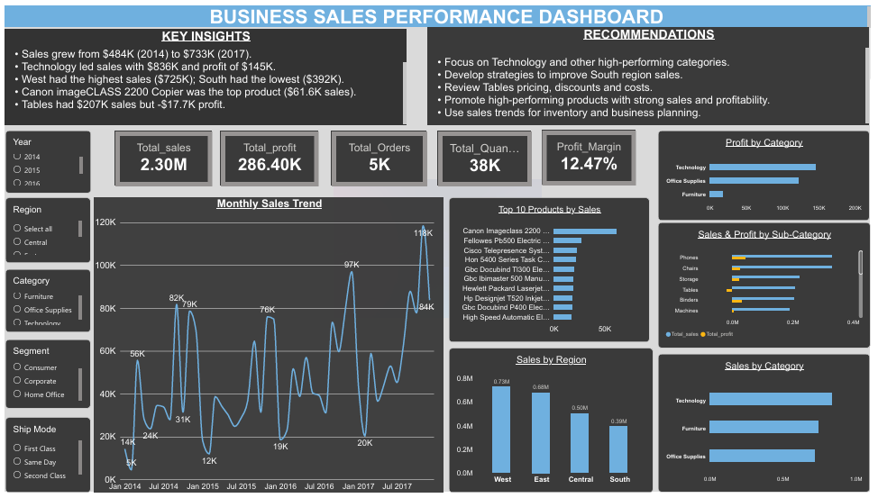

Business Sales Performance Analytics

## Project Overview

This project analyzes business sales data to understand sales performance, profitability, product performance, category performance, regional performance, and sales trends.

The project was completed as part of the **Future Interns – Data Science & Analytics Internship (Task 1).

## Objective

The main objectives of this project are to:

- Analyze revenue trends over time
- Identify top-selling products
- Analyze category and sub-category performance
- Compare regional sales performance
- Identify high-value and loss-making areas
- Generate actionable business insights and recommendations

## Tools Used

- **Microsoft Excel** – Data cleaning and preparation
- **Power BI** – Data analysis, KPI calculation, visualization, and dashboard creation

## Data Cleaning

The raw sales data was cleaned and prepared using Microsoft Excel.

The cleaning process included:

- Checking and handling missing values
- Checking for duplicate records
- Reviewing data types and formats
- Standardizing date formats
- Checking numerical fields for consistency
- Preparing the cleaned dataset for Power BI analysis

## Key KPIs

The dashboard includes the following KPIs:

- Total Sales: **$2.30M**
- Total Profit: **$286.40K**
- Total Orders: **5K**
- Total Quantity: **38K**
- Profit Margin: **12.47%**

## Dashboard Analysis

The Power BI dashboard includes:

- Monthly Sales Trend
- Top 10 Products by Sales
- Sales by Region
- Sales by Category
- Profit by Category
- Sales & Profit by Sub-Category
- Interactive filters for Year, Region, Category, Segment, and Ship Mode

## Key Insights

- Sales increased from approximately **$484K in 2014 to $733K in 2017**.
- **Technology** was the leading category, generating approximately **$836K in sales and $145K in profit**.
- **West** recorded the highest regional sales at approximately **$725K**, while **South** recorded the lowest at approximately **$392K**.
- **Canon imageCLASS 2200 Advanced Copier** was the top-selling product with approximately **$61.6K in sales**.
- The **Tables** sub-category generated approximately **$207K in sales but resulted in a $17.7K loss**.

## Recommendations

- Focus on Technology and other high-performing categories.
- Develop strategies to improve sales performance in the South region.
- Review pricing, discounts, and costs for the Tables sub-category.
- Promote high-performing products with strong sales and profitability.
- Use sales trends to support inventory and business planning decisions.

## Project Outcome

This project demonstrates practical skills in:

- Data Cleaning
- Excel Analysis
- Power BI
- KPI Analysis
- Data Visualization
- Business Analytics
- Insight Generation
- Business Recommendations

## Dashboard Preview

The final Power BI dashboard provides an interactive view of business sales performance and helps identify trends, high-performing products and categories, regional performance, and profitability opportunities.
